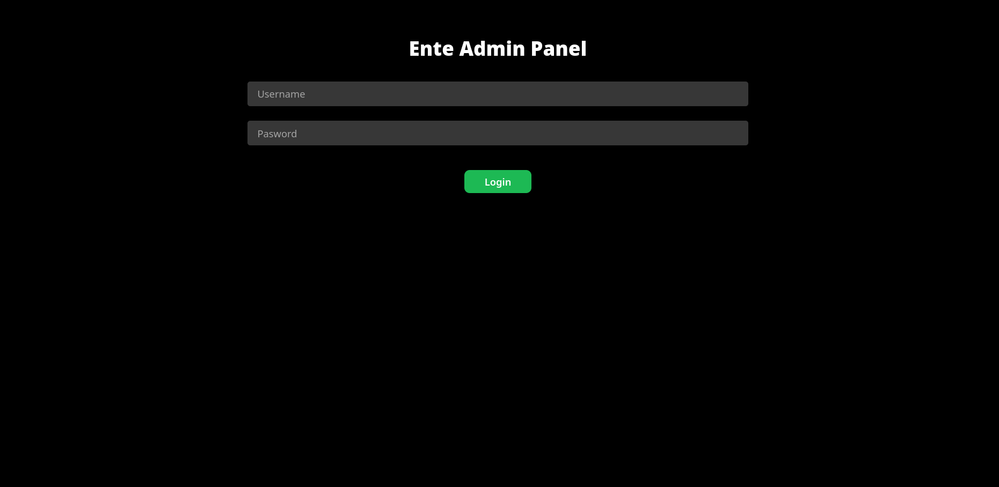

# Ente Admin UI

## Installation
Before using this, you must have Ente set up and selfhosted. [Ente quickstart](https://ente.com/help/self-hosting/)

First, you must edit the `compose.yaml` with your preferred editor. Scroll to the very bottom, and just before "volumes", add this:
```yaml
  ente-admin:
    image: atypicalpotato/ente-admin
    ports:
      - "80:80" # Or whatever port you want
    environment:
      DB_HOST: postgress # Database host here, quickstart uses postgres
      DB_NAME: ente_db # Database name here, quickstart uses ente_db
      DB_USER: pguser # Database username here, quickstart uses pguser
      DB_PASSWORD: 12345abcdef # Database password here, required
      ENTE_ENCRYPTION_KEY: abcdefg987654321 # The encryption key in museum.yaml, only used to decrypt the emails
      ADMINS: 123456789,987654321 # Your admin user ids, only to display the user as an admin on the ui - multiple ids may be separated by commas
      ADMIN_PASSWORD: securepassword # The password set for the admin panel
      ADMIN_USER: john # The username set for the admin panel
    depends_on:
      - postgres
```
Please edit the values for your setup and be sure they are correct.

Next, we are going to set up the verification code catcher. You can skip this if you want. Open the `museum.yaml` with any editor and add this to the very bottom:
```yaml
smtp:
  host: "ente-admin"
  port: "1025"
  username: ""
  password: ""
  email: "noreply@host.local"
  sender-name: "Admin"
  encryption: ""
```
That's it! Your admin panel is set up! You can now simply access it at your configured port and log in with the details you set!


## Motivation
I built this project because I found that using the cli to manage user tiers and see verification codes is very inefficient. This project solved these problems.

## AI policy
As a porgrammer, I believe that AI is a tool to be used, not a replacement. When building this project, AI was used mostly for debugging and structuring, and was not a full hands-off process.